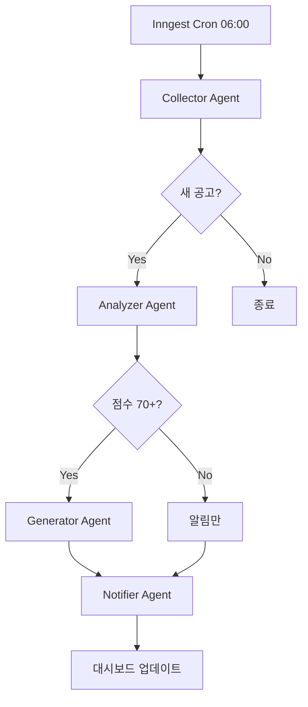

# BIDFLOW Agent 워크플로우 자동화 설계

> **목적**: Claude Agent SDK 기반 입찰 자동화 파이프라인
> **작성일**: 2025-12-20
> **상태**: 설계 완료, 구현 대기

---

## 1. 시스템 아키텍처

```
┌─────────────────────────────────────────────────────────────┐
│            BIDFLOW Agent Orchestration Platform             │
├─────────────────────────────────────────────────────────────┤
│                                                             │
│  ┌──────────────────────────────────────────────────────┐  │
│  │        Master Orchestrator Agent (Opus 4.5)          │  │
│  │    - 워크플로우 조율 / 결과 통합 / 의사결정          │  │
│  └──────────────────────────────────────────────────────┘  │
│              ↓         ↓          ↓         ↓              │
│  ┌─────────┐ ┌─────────┐ ┌────────┐ ┌──────────┐          │
│  │  수집    │ │  분석    │ │  생성   │ │  알림     │          │
│  │  Agent  │ │  Agent  │ │  Agent │ │  Agent   │          │
│  │(Sonnet) │ │(Opus)   │ │(Sonnet)│ │(Haiku)   │          │
│  └─────────┘ └─────────┘ └────────┘ └──────────┘          │
│       │           │          │          │                 │
│  ┌────────────────┴──────────┴──────────┴───────────┐     │
│  │     Custom MCP Tools (TypeScript SDK)             │     │
│  │  - BidCrawlTool          (나라장터/TED/SAM)      │     │
│  │  - BidAnalyzeTool        (AI 매칭)              │     │
│  │  - ProposalGenerateTool  (자동 생성)            │     │
│  │  - NotificationTool      (카카오톡/이메일)       │     │
│  └────────────────┬──────────┬──────────┬───────────┘     │
│                   ↓          ↓          ↓                 │
│          ┌──────────────────────────────────┐             │
│          │   Supabase PostgreSQL Database    │             │
│          │  - bids, companies, proposals     │             │
│          └──────────────────────────────────┘             │
└─────────────────────────────────────────────────────────────┘
```

---

## 2. 4개 핵심 에이전트

### 2.1 공고 수집 에이전트 (Collector Agent)

| 항목 | 내용 |
|------|------|
| **모델** | Claude 3.5 Sonnet |
| **역할** | 다중 소스 공고 크롤링 |
| **도구** | `crawl_narajangter`, `crawl_ted`, `crawl_sam` |
| **스케줄** | 매일 06:00 (Inngest cron) |

```typescript
const collectorAgent = {
  name: "bid-collector",
  description: "입찰 공고 자동 수집. 나라장터, TED, SAM.gov 병렬 크롤링",
  prompt: `당신은 입찰 공고 수집 전문가입니다.

직무:
1. 3개 데이터 소스에서 병렬로 공고 수집
2. 회사 관심사 키워드와 매칭
3. 중복 제거 및 메타데이터 추출
4. 데이터베이스에 저장`,
  model: "sonnet"
};
```

### 2.2 적합성 분석 에이전트 (Analyzer Agent)

| 항목 | 내용 |
|------|------|
| **모델** | Claude Opus 4.5 |
| **역할** | 공고-회사 매칭, 낙찰 확률 예측 |
| **도구** | `match_company_profile`, `analyze_competition`, `assess_risk` |
| **트리거** | 새 공고 수집 시 |

```typescript
const analyzerAgent = {
  name: "bid-analyzer",
  description: "입찰 적합성 평가. 요구사항 매칭, 경쟁 분석, 리스크 평가",
  prompt: `당신은 입찰 분석 전문가입니다.

분석 항목:
1. 기술적 적합성 (요구사항 매칭)
2. 재무적 타당성 (예산 범위)
3. 경쟁 분석 (예상 낙찰 확률)
4. 리스크 평가

점수 기준:
- 80+: 강력 권장
- 50-79: 조건부 검토
- 50-: 권장 안함`,
  model: "opus"
};
```

### 2.3 제안서 생성 에이전트 (Generator Agent)

| 항목 | 내용 |
|------|------|
| **모델** | Claude 3.5 Sonnet |
| **역할** | 제안서 자동 작성 |
| **도구** | `generate_executive_summary`, `generate_technical_proposal`, `generate_price_proposal` |
| **트리거** | 분석 점수 70+ 공고 |

```typescript
const generatorAgent = {
  name: "proposal-generator",
  description: "제안서 자동 생성. 과거 템플릿 기반 커스터마이징",
  prompt: `당신은 제안서 작성 전문가입니다.

직무:
1. 공고 요구사항 분석
2. 5개 섹션 자동 생성:
   - Executive Summary
   - 기술 제안
   - 가격제안서
   - 이행 일정
   - 회사 개요
3. PDF 컴파일`,
  model: "sonnet"
};
```

### 2.4 알림 에이전트 (Notifier Agent)

| 항목 | 내용 |
|------|------|
| **모델** | Claude 3.5 Haiku |
| **역할** | 다중 채널 알림 발송 |
| **도구** | `send_kakao`, `send_email`, `send_slack`, `update_dashboard` |
| **트리거** | 모든 단계 완료 시 |

```typescript
const notifierAgent = {
  name: "notification",
  description: "알림 및 상태 업데이트. 다중 채널 통지",
  prompt: `당신은 알림 담당자입니다.

알림 규칙:
- 긴급/고액: 카카오톡 + 이메일
- 일반: 슬랙 채널
- 항상: 대시보드 실시간 업데이트`,
  model: "haiku"
};
```

---

## 3. Custom MCP Tools

### 3.1 파일 구조

```
src/lib/agents/
├── index.ts              # 에이전트 내보내기
├── orchestrator.ts       # 마스터 오케스트레이터
├── tools/
│   ├── bid-crawler.ts    # 공고 수집 도구
│   ├── bid-analyzer.ts   # 분석 도구
│   ├── proposal-gen.ts   # 제안서 생성 도구
│   └── notification.ts   # 알림 도구
└── types/
    └── workflow.ts       # 타입 정의
```

### 3.2 도구 목록

| 도구 | 설명 | 입력 | 출력 |
|------|------|------|------|
| `crawl_narajangter` | 나라장터 API 크롤링 | keyword, date range | 공고 리스트 |
| `crawl_ted` | TED EU 입찰 크롤링 | keyword, CPV code | 공고 리스트 |
| `crawl_sam` | SAM.gov 크롤링 | keyword, NAICS | 공고 리스트 |
| `match_company_profile` | 공고-회사 매칭 | bid ID, company ID | 매칭 점수 |
| `analyze_competition` | 경쟁 분석 | bid ID | 낙찰 확률 |
| `assess_risk` | 리스크 평가 | bid ID | 리스크 레벨 |
| `generate_executive_summary` | 요약본 생성 | bid ID | 마크다운 |
| `generate_technical_proposal` | 기술 제안서 | bid ID | 마크다운 |
| `generate_price_proposal` | 가격제안서 | bid ID, margin | 마크다운 |
| `send_kakao` | 카카오톡 알림 | user ID, message | 성공/실패 |
| `send_email` | 이메일 발송 | email, content | 성공/실패 |
| `update_dashboard` | 대시보드 업데이트 | bid ID, status | 성공/실패 |

---

## 4. 워크플로우 실행

### 4.1 전체 파이프라인



### 4.2 API 엔드포인트

```typescript
// POST /api/v1/automation/start
{
  "bidId": "bid-12345",
  "companyId": "company-abc",
  "mode": "full" | "analyze_only" | "proposal_only"
}

// GET /api/v1/automation/status/:workflowId
{
  "status": "running" | "completed" | "failed",
  "currentStep": "analyzing",
  "progress": 65,
  "results": { ... }
}
```

### 4.3 Inngest 스케줄

| Job | 주기 | 설명 |
|-----|------|------|
| `daily-bid-crawl` | 매일 06:00 | 전체 소스 크롤링 |
| `daily-bid-analysis` | 매일 08:00 | 새 공고 분석 |
| `deadline-reminder` | 매일 09:00 | D-7 마감 알림 |
| `weekly-report` | 매주 월요일 09:00 | 주간 리포트 |

---

## 5. 구현 로드맵

### Phase 1: 기초 (2주)
- [ ] Claude Agent SDK 설치
- [ ] 4개 커스텀 도구 정의 (Mock 데이터)
- [ ] 마스터 오케스트레이터 프로토타입
- [ ] 단위 테스트

### Phase 2: 통합 (3주)
- [ ] 실제 API 연동 (나라장터, TED, SAM)
- [ ] Supabase 스키마 확장
- [ ] 4개 에이전트 고도화
- [ ] 알림 시스템 통합

### Phase 3: 최적화 (2주)
- [ ] 병렬 처리 및 토큰 절감
- [ ] 에러 복구 메커니즘
- [ ] 프로덕션 배포
- [ ] 모니터링 대시보드

### Phase 4: 확장 (향후)
- [ ] ML 모델 (낙찰 확률 예측)
- [ ] 다국어 지원
- [ ] 엔터프라이즈 기능

---

## 6. 비용 추정

| 항목 | 월간 추정 | 비고 |
|------|----------|------|
| Claude Opus 4.5 | $300 | 분석 에이전트 |
| Claude Sonnet | $200 | 수집/생성 에이전트 |
| Claude Haiku | $30 | 알림 에이전트 |
| Supabase Pro | $25 | 데이터베이스 |
| Inngest Pro | $20 | 스케줄러 |
| **합계** | **$575/월** | 약 75만원 |

---

## 7. 보안 고려사항

### 7.1 권한 제어

```typescript
// 도구별 권한 제한
options: {
  permissionMode: "acceptEdits",
  allowedTools: ["Read", "Glob", "Task"],  // 쓰기 제한
  deniedTools: ["Bash"],  // 시스템 명령 금지
}
```

### 7.2 감사 로그

```typescript
hooks: {
  PostToolUse: [{
    matcher: "*",
    hooks: [logAuditEvent]
  }]
}
```

### 7.3 데이터 보호

- API 키: 환경변수로 관리
- 민감 정보: Supabase RLS
- 통신: HTTPS 강제

---

*Claude Agent SDK 기반 BIDFLOW 자동화 설계 v1.0*
*2025-12-20*
