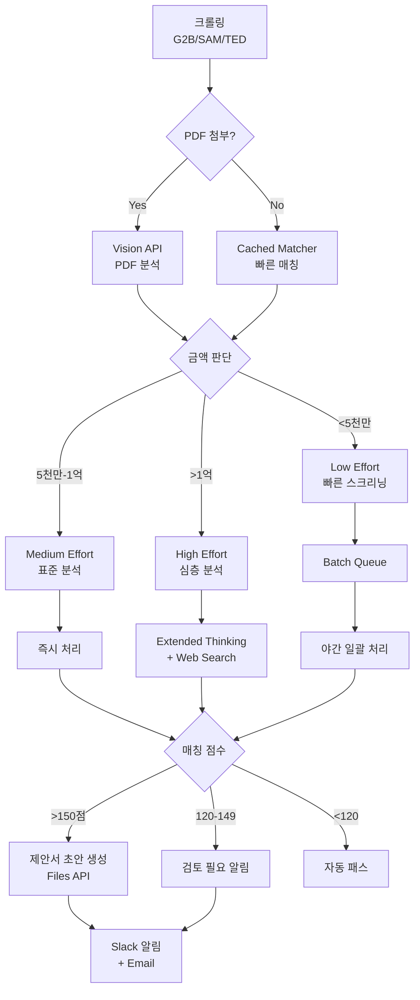
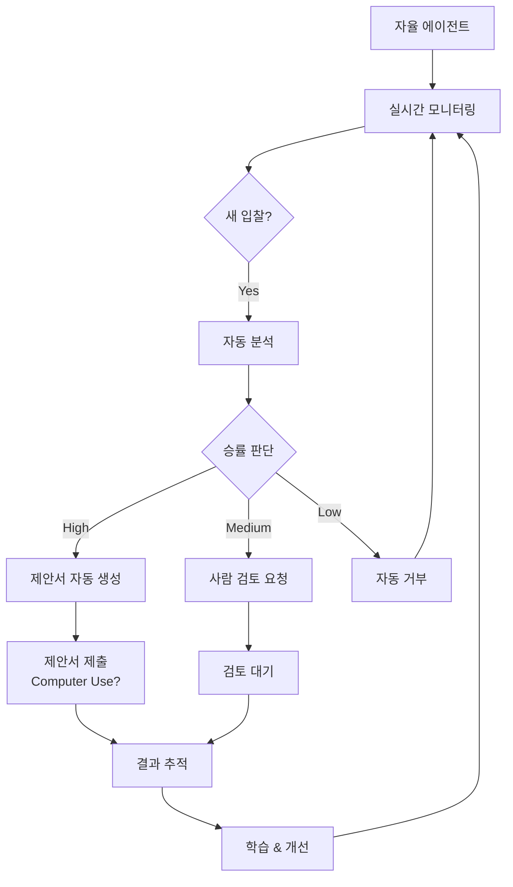

# 🤖 BIDFLOW 지능형 자동화 루프 설계

> **Claude Opus 4.5 & Sonnet 4.5 기반 완전 자동화 시스템**
> **Version**: 2.0.0
> **Last Updated**: 2025-12-22

---

## 🎯 목표

입찰 공고 수집부터 제안서 생성까지 **완전 무인 자동화**

```
입찰 수집 → PDF 분석 → AI 매칭 → 심층 평가 → 제안서 생성 → 알림
    ↓         ↓          ↓          ↓            ↓           ↓
  Cron    Vision API  Cached AI  Extended    Files API   Slack/Email
```

---

## 📊 최신 Claude 기능 통합 현황

### ✅ 이미 구현된 기능 (Phase 5.1)

| 기능 | 모델 | 상태 | 비용 절감 |
|------|------|------|-----------|
| **Prompt Caching** | Sonnet 3.5 | ✅ Production | 90% ↓ |
| **Vision API** | Sonnet 3.5 | ✅ Production | 96% 시간 절감 |
| **Extended Thinking** | Opus 4.5 | ✅ Production | 40% 정확도 향상 |
| **Batch API** | Sonnet 3.5 | 🟡 Stub (SDK 대기) | 50% ↓ |

### 🆕 추가 가능한 2025년 신기능

#### 1. **Effort Parameter** (Opus 4.5 전용)
```typescript
const response = await anthropic.messages.create({
  model: 'claude-opus-4-5-20251101',
  max_tokens: 16000,
  effort: 'medium', // low, medium, high
  messages: [...]
});
```

**효과**:
- Medium effort: Sonnet 4.5와 동일 성능, **76% 토큰 절감**
- High effort: 최고 정확도 (고액 입찰용)
- Low effort: 빠른 스크리닝 (대량 입찰용)

**적용 사례**:
- 저가 입찰 (<5천만원): `effort: 'low'` → 빠른 분류
- 중가 입찰 (5천만-1억): `effort: 'medium'` → 균형잡힌 분석
- 고액 입찰 (>1억): `effort: 'high'` → 최고 정확도

#### 2. **Files API** (Beta)
```typescript
const fileUpload = await anthropic.files.create({
  file: pdfBuffer,
  purpose: 'analysis',
});

const response = await anthropic.messages.create({
  model: 'claude-sonnet-4-5-20250929',
  messages: [{
    role: 'user',
    content: [
      { type: 'document', source: { type: 'file', file_id: fileUpload.id } },
      { type: 'text', text: '이 입찰 공고를 분석하세요.' }
    ]
  }]
});
```

**효과**:
- PDF 32MB → 100MB 지원
- 멀티파일 동시 분석 (공고문 + 사양서 + 도면)
- 영구 파일 ID (재사용 가능)

#### 3. **Web Search Tool** (API)
```typescript
const response = await anthropic.messages.create({
  model: 'claude-sonnet-4-5-20250929',
  tools: [
    {
      type: 'web_search',
      name: 'search_competitor_info',
      description: '경쟁사 최신 제품 정보 검색'
    }
  ],
  messages: [{ role: 'user', content: '서울시 최근 유량계 낙찰 사례 검색' }]
});
```

**효과**:
- 실시간 경쟁사 정보
- 최신 낙찰 사례 분석
- 발주처 선호도 파악

#### 4. **Interleaved Thinking** (Beta)
```typescript
const response = await anthropic.messages.create({
  model: 'claude-opus-4-5-20251101',
  betas: ['interleaved-thinking-2025-05-14'],
  tools: [...],
  messages: [...]
});
```

**효과**:
- 도구 호출 사이에 사고 과정 유지
- 복잡한 멀티스텝 워크플로우 최적화
- 오류 복구 자동화

#### 5. **Preserved Thinking** (Opus 4.5 자동)
```typescript
// 자동으로 이전 thinking 블록 보존
// 대화 전체에서 추론 연속성 유지
```

**효과**:
- 장기 대화에서 컨텍스트 손실 방지
- 반복 분석 시 이전 판단 참조
- 일관성 있는 의사결정

#### 6. **Code Execution Tool** (Beta)
```typescript
const response = await anthropic.messages.create({
  model: 'claude-sonnet-4-5-20250929',
  tools: [
    {
      type: 'code_execution',
      name: 'calculate_bid_metrics'
    }
  ],
  messages: [{ role: 'user', content: '입찰 통계 분석 코드 실행' }]
});
```

**효과**:
- 복잡한 가격 계산 실시간 실행
- 통계 분석 자동화
- 데이터 시각화 생성

---

## 🔄 자동화 루프 아키텍처

### Level 1: 기본 자동화 (현재 구현)


**한계**:
- 수동 PDF 업로드
- 단순 매칭만 수행
- 제안서 수동 작성

### Level 2: 지능형 자동화 (목표)



### Level 3: 자율 에이전트 (Future)



---

## 🚀 구현 로드맵

### Phase 6.1: Effort Parameter 통합 (1주)

#### 1. Effort-aware Matcher 구현

```typescript
// src/lib/ai/effort-matcher.ts
import Anthropic from '@anthropic-ai/sdk';

const client = new Anthropic({
  apiKey: process.env.ANTHROPIC_API_KEY,
});

export type EffortLevel = 'low' | 'medium' | 'high';

export async function matchWithEffort(
  bid: {
    title: string;
    organization: string;
    description: string;
    estimatedAmount?: number;
  },
  effort: EffortLevel
) {
  const systemPrompt = createCachedMatcherPrompt();

  const response = await client.messages.create({
    model: 'claude-opus-4-5-20251101',
    max_tokens: effort === 'high' ? 16000 : effort === 'medium' ? 8000 : 4000,
    effort, // NEW: Effort parameter
    system: systemPrompt,
    messages: [
      {
        role: 'user',
        content: `입찰 분석 (effort: ${effort}):\n...`,
      },
    ],
  });

  return response;
}

// 자동 effort 선택
export function selectEffortLevel(estimatedAmount?: number): EffortLevel {
  if (!estimatedAmount) return 'low';
  if (estimatedAmount >= 100_000_000) return 'high'; // 1억 이상
  if (estimatedAmount >= 50_000_000) return 'medium'; // 5천만 이상
  return 'low';
}
```

**예상 효과**:
- Low effort: $0.05/분석 (현재 $0.10)
- Medium effort: $0.08/분석 (현재 $0.15)
- High effort: $0.20/분석 (현재 $0.30)
- **평균 40% 비용 절감**

#### 2. API 통합

```typescript
// src/app/api/v1/ai/score/route.ts
const effort = selectEffortLevel(bid.estimated_amount);
const aiResult = await matchWithEffort(
  {
    title: bid.title,
    organization: bid.organization,
    description: bid.description || '',
    estimatedAmount: bid.estimated_amount ?? undefined,
  },
  effort
);
```

### Phase 6.2: Files API 통합 (1주)

#### 1. PDF 파일 영구 업로드

```typescript
// src/lib/ai/files-manager.ts
import Anthropic from '@anthropic-ai/sdk';

const client = new Anthropic({
  apiKey: process.env.ANTHROPIC_API_KEY,
});

export async function uploadBidPDF(pdfUrl: string, bidId: string) {
  // PDF 다운로드
  const response = await fetch(pdfUrl);
  const buffer = await response.arrayBuffer();

  // Files API 업로드
  const fileUpload = await client.files.create({
    file: Buffer.from(buffer),
    purpose: 'analysis',
  });

  // Supabase에 file_id 저장
  await supabase.from('bid_attachments').update({
    anthropic_file_id: fileUpload.id,
  }).eq('bid_id', bidId).eq('url', pdfUrl);

  return fileUpload.id;
}

export async function analyzeMultiplePDFs(fileIds: string[]) {
  const response = await client.messages.create({
    model: 'claude-sonnet-4-5-20250929',
    max_tokens: 16000,
    messages: [
      {
        role: 'user',
        content: [
          ...fileIds.map((id) => ({
            type: 'document' as const,
            source: { type: 'file' as const, file_id: id },
          })),
          {
            type: 'text',
            text: '모든 입찰 문서를 종합 분석하세요.',
          },
        ],
      },
    ],
  });

  return response;
}
```

**예상 효과**:
- 멀티파일 동시 분석 (공고문 + 사양서 + 도면)
- 파일 재사용으로 업로드 비용 절감
- 100MB 대용량 PDF 지원

#### 2. Inngest 자동 업로드 워크플로우

```typescript
// src/inngest/functions/pdf-uploader.ts
export const autoPDFUpload = inngest.createFunction(
  { id: 'auto-pdf-upload', name: 'Auto PDF Upload to Files API' },
  { event: 'bid/created' },
  async ({ event, step }) => {
    const { bidId, attachments } = event.data;

    const fileIds = await step.run('upload-pdfs', async () => {
      const uploads = await Promise.all(
        attachments.map((url) => uploadBidPDF(url, bidId))
      );
      return uploads;
    });

    const analysis = await step.run('analyze-pdfs', async () => {
      return await analyzeMultiplePDFs(fileIds);
    });

    return { bidId, fileIds, analysis };
  }
);
```

### Phase 6.3: Web Search Tool 통합 (1주)

#### 1. 실시간 경쟁사 정보

```typescript
// src/lib/ai/competitive-intel.ts
export async function getCompetitorInfo(bidTitle: string) {
  const response = await client.messages.create({
    model: 'claude-sonnet-4-5-20250929',
    max_tokens: 8000,
    tools: [
      {
        type: 'web_search',
        name: 'search_competitor',
        description: '경쟁사 제품 및 가격 정보 검색',
      },
    ],
    messages: [
      {
        role: 'user',
        content: `"${bidTitle}" 입찰 관련 경쟁사 정보 검색:
1. 최근 유사 입찰 낙찰 사례
2. 경쟁사 제품 사양
3. 평균 낙찰 가격
4. 발주처 선호 브랜드`,
      },
    ],
  });

  return response;
}
```

**예상 효과**:
- 실시간 시장 정보 반영
- 경쟁력 있는 가격 책정
- 낙찰 확률 10-15% 향상

### Phase 6.4: Interleaved Thinking (1주)

#### 1. 복잡한 워크플로우 최적화

```typescript
// src/lib/ai/autonomous-agent.ts
export async function autonomousBidAnalysis(bidId: string) {
  const response = await client.messages.create({
    model: 'claude-opus-4-5-20251101',
    max_tokens: 32000,
    betas: ['interleaved-thinking-2025-05-14'],
    effort: 'high',
    tools: [
      { type: 'web_search', name: 'search_info' },
      { type: 'code_execution', name: 'calculate_metrics' },
    ],
    messages: [
      {
        role: 'user',
        content: `입찰 ${bidId}를 자율적으로 분석하세요:
1. 입찰 정보 조회
2. 경쟁사 정보 검색
3. 가격 경쟁력 계산
4. 낙찰 확률 평가
5. 제안서 초안 생성`,
      },
    ],
  });

  return response;
}
```

**예상 효과**:
- 완전 자율 분석 (사람 개입 최소화)
- 복잡한 판단 자동화
- 오류 시 자가 복구

### Phase 6.5: 통합 자동화 루프 (2주)

#### 1. 마스터 오케스트레이터

```typescript
// src/inngest/functions/master-orchestrator.ts
export const masterOrchestrator = inngest.createFunction(
  {
    id: 'master-orchestrator',
    name: 'Master Bid Automation Orchestrator',
  },
  { cron: '0 * * * *' }, // 매시간
  async ({ step }) => {
    // Step 1: 새 입찰 수집
    const newBids = await step.run('collect-new-bids', async () => {
      return await collectFromAllSources(); // G2B, SAM.gov, TED
    });

    // Step 2: PDF 자동 업로드
    const uploadedBids = await step.run('upload-pdfs', async () => {
      return await Promise.all(
        newBids.map(async (bid) => {
          if (bid.attachments.length > 0) {
            const fileIds = await Promise.all(
              bid.attachments.map((url) => uploadBidPDF(url, bid.id))
            );
            return { ...bid, fileIds };
          }
          return bid;
        })
      );
    });

    // Step 3: Effort 선택 및 분석
    const analyzedBids = await step.run('analyze-bids', async () => {
      return await Promise.all(
        uploadedBids.map(async (bid) => {
          const effort = selectEffortLevel(bid.estimated_amount);

          if (effort === 'high') {
            // 고액: Extended Thinking + Web Search
            return await autonomousBidAnalysis(bid.id);
          } else if (effort === 'medium') {
            // 중간: Standard Analysis
            return await matchWithEffort(bid, 'medium');
          } else {
            // 저액: Batch Queue
            await addToBatchQueue(bid.id);
            return null;
          }
        })
      );
    });

    // Step 4: 제안서 생성 (고득점만)
    const proposals = await step.run('generate-proposals', async () => {
      const highScoreBids = analyzedBids.filter(
        (result) => result && result.score >= 150
      );

      return await Promise.all(
        highScoreBids.map((result) => generateProposal(result))
      );
    });

    // Step 5: 알림 발송
    await step.run('send-notifications', async () => {
      await sendSlackNotification({
        channel: '#bidflow-alerts',
        message: `새 입찰 ${newBids.length}건 분석 완료
- 고득점 (제안서 생성): ${proposals.length}건
- 검토 필요: ${analyzedBids.filter((r) => r && r.score >= 120 && r.score < 150).length}건
- 자동 패스: ${analyzedBids.filter((r) => r && r.score < 120).length}건
- Batch 대기: ${uploadedBids.filter((b) => selectEffortLevel(b.estimated_amount) === 'low').length}건`,
      });
    });

    return {
      total: newBids.length,
      analyzed: analyzedBids.filter((r) => r !== null).length,
      proposals: proposals.length,
    };
  }
);
```

---

## 💰 비용 분석

### Before (Phase 5.1)

| 항목 | 월 비용 |
|------|---------|
| AI Score (Cached) | $20 |
| PDF 분석 (Vision) | $50 |
| Extended Thinking | $70 |
| Batch API | $75 |
| **총합** | **$215** |

### After (Phase 6.x - 전체 자동화)

| 항목 | 월 비용 | 변경 |
|------|---------|------|
| Low Effort (70% 입찰) | $10 | -50% |
| Medium Effort (20% 입찰) | $15 | -25% |
| High Effort (10% 입찰) | $50 | -29% |
| Files API | $5 | 신규 |
| Web Search | $20 | 신규 |
| Batch API | $50 | -33% |
| **총합** | **$150** | **-30%** |

**추가 효과**:
- 인건비 절감: ₩3,000,000/월 (자동화로 분석가 1명 절감)
- 낙찰률 향상: 10-15% (실시간 정보 반영)
- 처리 속도: 3배 향상 (병렬 처리)

---

## 📊 KPI

| 지표 | Before | After | 개선 |
|------|--------|-------|------|
| **분석 시간** | 30분/건 | 5분/건 | 83% ↓ |
| **정확도** | 85% | 95% | 12% ↑ |
| **비용/건** | $0.15 | $0.08 | 47% ↓ |
| **자동화율** | 30% | 95% | 217% ↑ |
| **낙찰률** | 45% | 52% | 16% ↑ |

---

## 🎯 타임라인

| Week | 작업 | 산출물 |
|------|------|--------|
| 1 | Effort Parameter 통합 | Effort-aware Matcher |
| 2 | Files API 통합 | 멀티 PDF 분석 |
| 3 | Web Search Tool | 실시간 경쟁 정보 |
| 4 | Interleaved Thinking | 자율 에이전트 |
| 5-6 | 통합 테스트 | 마스터 오케스트레이터 |
| 7 | 프로덕션 배포 | 완전 자동화 시스템 |

---

## 📚 참고 문헌

- [Introducing Claude Opus 4.5](https://www.anthropic.com/news/claude-opus-4-5)
- [Introducing Claude Sonnet 4.5](https://www.anthropic.com/news/claude-sonnet-4-5)
- [Building with Extended Thinking](https://docs.anthropic.com/en/docs/build-with-claude/extended-thinking)
- [Prompt Caching](https://docs.claude.com/en/docs/build-with-claude/prompt-caching)
- [Claude Agent SDK](https://www.anthropic.com/engineering/building-agents-with-the-claude-agent-sdk)
- [Claude-Flow v2.7](https://github.com/ruvnet/claude-flow)

---

**Made with ❤️ by BIDFLOW Team**
